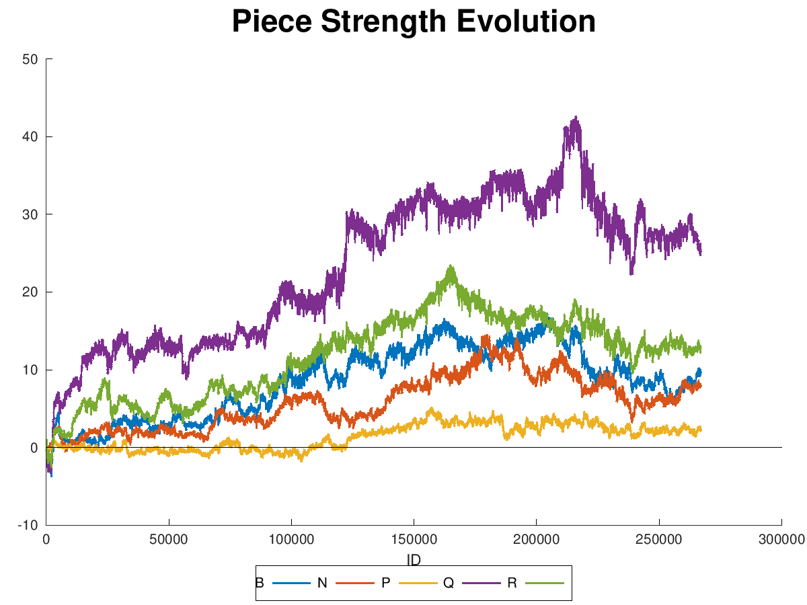

# Genetic Chess

An amateur attempt at breeding a chess-playing AI.

This program attempts to create a chess-playing AI by playing prospective AIs
against each and letting the winners produce mutated copies. As evidence that
this has a chance of working, here's a plot from a recent run of the value that
the AIs place on each type of piece.

It took awhile (tens of thousands of generations), but it did figure out that
the queen was an important piece. The vertical axis has arbitrary units that
indicate the relative value of each piece type.

See the `doc/` folder for an in-depth description of the running and working of
this project.

### Quick start to play a game

1. Clone this repository to your computer.
2. `make`
    * If on Windows and Visual Studio is installed, open Genetic_Chess.sln
      and compile.
3. `bin/release/genetic_chess -genetic genetic_ai_example.txt -human`
    * or, if you want to play white: `bin/genetic_chess -human -genetic
      genetic_ai_example.txt`
    * If compiling with Visual Studio, look in x86\Release or x64\Release
      for the compiled program.
4. Do not expect to be impressed by the quality of play.

### Quick start to starting a gene pool

1. Clone this repository to your computer.
2. `make`
    * If on Windows and Visual Studio is installed, open Genetic_Chess.sln
      and compile.
3. Edit `gene_pool_config_example.txt` to adjust the number of simultaneous
   games to a number less than or equal to the number of processors on your
   computer.
4. `bin/release/genetic_chess -genepool gene_pool_config_example.txt`
    * If compiling with Visual Studio, look in x86\Release or x64\Release
      for the compiled program.
5. About once a day, pause the gene pool with `Ctrl-C` and run
   `analysis/run_all_plots.sh pool.txt` to generate plots and other data
   showing the evolution and behavior of the specimens.
   * This script requires the program `octave` to run.
