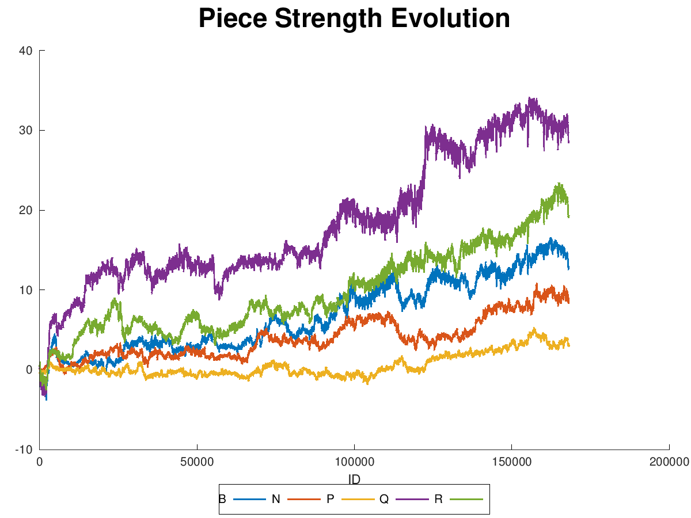

# Genetic Chess

An amateur attempt at breeding a chess-playing AI.

See the `doc/` folder for an in-depth description of the running and working of
this project.

As a short summary, this program attempts to create a chess-playing AI by
playing prospective AIs against each and letting the winners produce mutated
copies. As evidence that this has a chance of working, here's a plot from a
recent run of the value that the AIs place on each type of piece.

It took awhile (tens of thousands of generations), but it did figure out that
the queen was an important piece.
