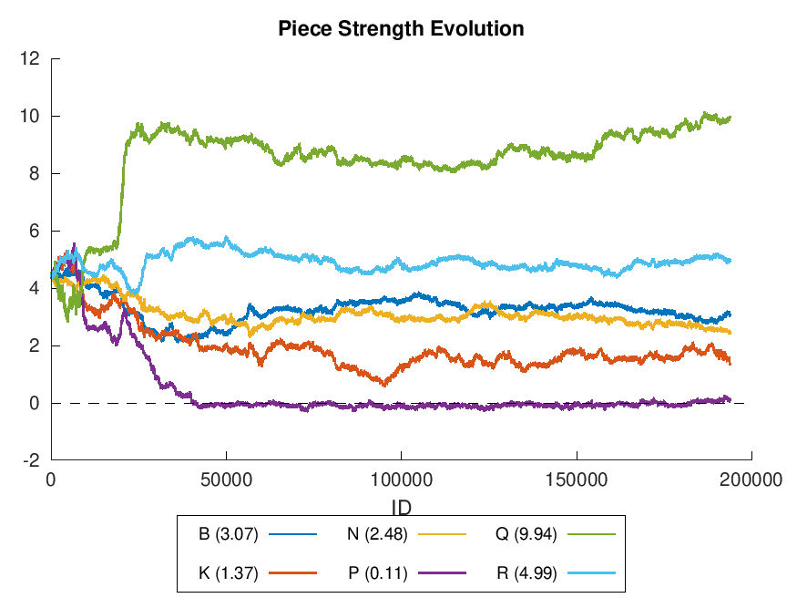

# Genetic Chess

An amateur attempt at breeding a chess-playing AI.

This program attempts to create a chess-playing AI by playing prospective AIs
against each and letting the winners produce mutated copies. As evidence that
this has a chance of working, here's a plot from a recent run of the value that
the AIs place on each type of piece.

It took awhile (tens of thousands of generations), but it did figure out the
correct ordering and relative value of the major pieces. Pawns have other
genes measuring the influence of their positions, so their absolute value
tends to be zero instead of the traditional one.

See the `doc/` folder for an in-depth description of the running and working of
this project.

### Quick build instructions
#### Linux
0. Install `gcc` or `clang`
1. Clone this repository to your computer.
2. `./create_Makefile gcc` (or `clang`)
3. `make release`

#### Windows
1. Clone this repository to your computer.
2. Open Genetic_Chess.sln in Visual Studio and compile.

#### More documentation
A copy of the user manual PDF is already in the `doc/` folder.
- `make user_manual` for the User Manual pdf (requires `pdflatex`)
    - Or compile `doc/reference.tex` with [TexWriter](https://www.xm1math.net/texmaker/) or similar.
- `make code_docs` for HTML source code references
    - Or generate with [Doxygen](http://www.doxygen.nl/)
- `make docs` for both

### Start a game
1. Install a chess GUI (e.g., [cutechess](https://cutechess.com/))
2. Create a new engine with the compiled executable and with the command-line
   parameters `-genetic genetic_ai_example.txt`
    - After running a gene pool, you can replace the `genetic_ai_example.txt`
      argument with the file name and ID number of the best specimen from the
      gene pool.

### Start a gene pool
1. Edit `gene_pool_config_example.txt` to adjust the number of simultaneous
   games to a number less than or equal to the number of processors on your
   computer.
2. `<bin location>/genetic_chess -gene-pool gene_pool_config_example.txt`
    * If compiling with Visual Studio, look in x86/Release or x64/Release
      for the compiled program.
3. Every few hours or days, pause the gene pool with `Ctrl-Z` (Linux) or `Ctrl-C`
   (on Windows) and run `analysis/run_all_plots.sh gene_pool_config_example.txt 1`
   to generate plots and other data showing the evolution and behavior of the specimens.
   * This script requires the program `octave` to run.
